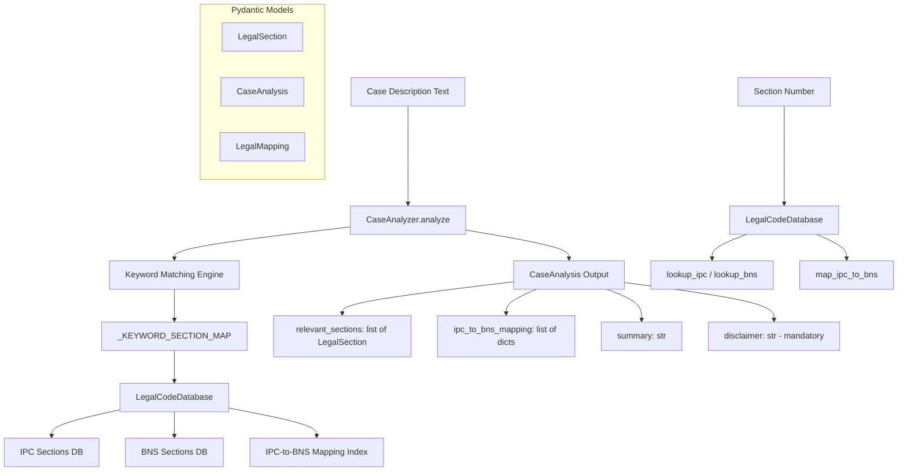

# aumai-openjudge

**Indian Legal Code Analyser — IPC/BNS statute mapping, keyword-based case analysis, and IPC-to-BNS cross-reference.**

Part of the [AumAI](https://github.com/aumai) open source ecosystem for agentic AI infrastructure.

[](https://github.com/aumai/aumai-openjudge/actions)
[](https://pypi.org/project/aumai-openjudge/)
[](https://www.python.org/)
[](LICENSE)

---

> **IMPORTANT LEGAL DISCLAIMER:** aumai-openjudge does NOT provide legal advice of any kind.
> All case analysis is based entirely on keyword matching against a curated section database
> and may be incomplete, incorrect, or inapplicable to specific circumstances.
> This tool is intended solely for educational, research, and awareness purposes.
> It is NOT a substitute for advice from a qualified, licensed advocate.
> Never make legal decisions — including filing FIRs, responding to charges, or entering into
> legal proceedings — based solely on the output of this tool.
> Always consult a qualified legal professional.
> The authors and contributors accept no liability for actions taken based on this tool's output.

---

## What Is This?

Think of aumai-openjudge as a **legal statute search engine and case pre-analysis tool** for Indian law. When a legal researcher, law student, paralegal, or journalist reads about an incident and wants to understand which sections of Indian law might be involved, they traditionally need to dig through the Indian Penal Code, memorise section numbers, and then cross-reference those numbers against the new Bharatiya Nyaya Sanhita that replaced the IPC from 1 July 2024.

aumai-openjudge automates that first-pass analysis. You describe a case in plain English, and the analyser returns the relevant IPC and BNS sections, their punishments, bailable status, and a summary — all with mandatory disclaimers embedded in every output.

It also provides a structured database of the 30 most significant IPC sections (and their 28 BNS equivalents), with a complete IPC-to-BNS mapping table for the most common criminal provisions.

### Why Does This Matter? (First Principles)

On 1 July 2024, India replaced its 163-year-old Indian Penal Code (1860) with the Bharatiya Nyaya Sanhita (2023). Simultaneously, the Code of Criminal Procedure was replaced by the Bharatiya Nagarik Suraksha Sanhita, and the Indian Evidence Act was replaced by the Bharatiya Sakshya Adhiniyam.

This is one of the largest criminal law transitions in any country's history. Thousands of legal practitioners, law students, journalists, researchers, academics, and legal aid workers need to understand:

1. What does a given IPC section correspond to in the BNS?
2. What new cases are charged under which BNS sections?
3. How do old case citations (under IPC) map to the new framework?

aumai-openjudge provides deterministic, offline, open source infrastructure for answering these questions programmatically — especially valuable for legal aid systems, case management tools, and legal education platforms.

---

## Architecture



### Component Responsibilities

| Component | Responsibility |
|---|---|
| `LegalCodeDatabase` | In-memory storage of IPC sections, BNS sections, and IPC-to-BNS mapping; lookup by section number |
| `CaseAnalyzer` | Performs keyword-based analysis of case descriptions; returns a `CaseAnalysis` with all relevant sections |
| `LegalSection` | Pydantic model for a single IPC or BNS provision |
| `CaseAnalysis` | Pydantic model representing the full analysis result including disclaimer |
| `LegalMapping` | Pydantic model representing the mapping between an old IPC section and its new BNS equivalent |

---

## Features

- **30 IPC sections** covering India's most commonly invoked criminal provisions
- **28 BNS 2023 sections** corresponding to the above, with updated punishment provisions
- **27 IPC-to-BNS mappings** with status (replaced/amended/repealed)
- **Keyword-based case analysis** matching 27 offence categories across 100+ keywords
- **Automatic IPC-to-BNS cross-referencing** in every case analysis output
- **Bailable/non-bailable status** for each section
- **Mandatory legal disclaimers** embedded in all analysis outputs and CLI output
- **Pydantic v2 models** with strict validation (code field validates against known code names)
- **Click CLI** with `serve` command for HTTP API mode
- **FastAPI server** mode for integration into legal aid platforms and case management systems
- **Zero external LLM dependency** — all analysis is deterministic keyword matching, fully offline

### Section Coverage

| IPC Section | BNS Section | Offence |
|---|---|---|
| 302 | 103 | Murder |
| 307 | 109 | Attempt to murder |
| 304 | 105 | Culpable homicide not amounting to murder |
| 376 | 64 | Rape |
| 379 | 303 | Theft |
| 380 | 305 | Theft in dwelling house |
| 392 | 309 | Robbery |
| 395 | 310 | Dacoity |
| 420 | 318 | Cheating (inducing delivery of property) |
| 406 | 316 | Criminal breach of trust |
| 498A | 85 | Cruelty by husband or relatives |
| 304B | 80 | Dowry death |
| 363 | 137 | Kidnapping |
| 354 | 74 | Assault to outrage modesty of woman |
| 323 | 115 | Voluntarily causing hurt |
| 325 | 117 | Voluntarily causing grievous hurt |
| 341 | 126 | Wrongful restraint |
| 506 | 351 | Criminal intimidation |
| 120B | 61 | Criminal conspiracy |
| 34 | 3(5) | Acts in furtherance of common intention |
| 147 | 191 | Rioting |
| 153A | 196 | Promoting enmity between groups |
| 295A | — | Deliberate acts to outrage religious feelings |
| 411 | 302 | Dishonestly receiving stolen property |
| 193 | 229 | Giving false evidence / perjury |
| 415 | 318 | Cheating |
| 447 | 329 | Criminal trespass |
| 279 | 281 | Rash driving |
| 304A | 106 | Causing death by negligence (includes hit-and-run) |
| 509 | 79 | Acts intended to insult modesty of woman |

---

## Quick Start

### Installation

```bash
pip install aumai-openjudge
```

From source:

```bash
git clone https://github.com/aumai/aumai-openjudge
cd aumai-openjudge
pip install -e .
```

### Analyse a Case in Python

```python
from aumai_openjudge.core import CaseAnalyzer

# DISCLAIMER: This does NOT constitute legal advice.
analyzer = CaseAnalyzer()

analysis = analyzer.analyze(
    "The accused broke into the victim's house at night and committed theft."
)

print(analysis.summary)
print("\nRelevant sections:")
for section in analysis.relevant_sections:
    print(f"  {section.code} {section.section_number}: {section.title}")
    print(f"    Punishment: {section.punishment}")
    print(f"    Bailable: {section.bailable}")

print("\nIPC to BNS mapping:")
for mapping in analysis.ipc_to_bns_mapping:
    print(f"  {mapping['ipc']} -> {mapping['bns']} ({mapping['status']})")

print(f"\nDISCLAIMER: {analysis.disclaimer}")
```

### Look Up a Specific Section

```python
from aumai_openjudge.core import LegalCodeDatabase

db = LegalCodeDatabase()

# Look up an IPC section
ipc_302 = db.lookup_ipc("302")
print(f"IPC 302: {ipc_302.title}")
print(f"Punishment: {ipc_302.punishment}")
print(f"Bailable: {ipc_302.bailable}")

# Get the BNS equivalent
mapping = db.map_ipc_to_bns("302")
print(f"BNS equivalent: {mapping.new_code} {mapping.new_section} (status: {mapping.status})")

# Look up the BNS section directly
bns_103 = db.lookup_bns("103")
print(f"BNS 103: {bns_103.description}")
```

---

## CLI Reference

### `aumai-openjudge serve`

Start the Openjudge FastAPI server.

```bash
aumai-openjudge serve [--host HOST] [--port PORT]
```

| Option | Default | Description |
|---|---|---|
| `--host` | `127.0.0.1` | Host interface to bind to |
| `--port` | `8000` | TCP port to listen on |

Requires `uvicorn` to be installed (`pip install uvicorn`). The mandatory legal disclaimer is printed to stdout before the server starts.

**Example:**

```bash
aumai-openjudge serve --host 0.0.0.0 --port 8080
```

---

## Python API Examples

### Case Analysis

```python
from aumai_openjudge.core import CaseAnalyzer

# IMPORTANT: This does NOT provide legal advice.
analyzer = CaseAnalyzer()

# Domestic violence case
analysis1 = analyzer.analyze(
    "The husband subjected his wife to severe cruelty and dowry harassment for two years."
)
print(analysis1.summary)

# Hit and run
analysis2 = analyzer.analyze(
    "The driver was driving rashly and caused death by negligence in a hit and run accident."
)
for section in analysis2.relevant_sections:
    print(f"  {section.code} {section.section_number}: {section.title}")

# Multiple offences
analysis3 = analyzer.analyze(
    "The accused, along with co-conspirators, committed robbery and criminal intimidation."
)
print(f"\nMatched {len(analysis3.relevant_sections)} sections")
for m in analysis3.ipc_to_bns_mapping:
    print(f"  {m['ipc']} -> {m['bns']}")
```

### Section Database Lookups

```python
from aumai_openjudge.core import LegalCodeDatabase

db = LegalCodeDatabase()

# Browse all IPC sections
print("IPC sections in database:")
for section in db.all_ipc():
    bailable = "Bailable" if section.bailable else "Non-bailable" if section.bailable is False else "N/A"
    print(f"  IPC {section.section_number}: {section.title} [{bailable}]")

# Browse all BNS sections
print("\nBNS sections in database:")
for section in db.all_bns():
    print(f"  BNS {section.section_number}: {section.title}")

# Cross-reference lookup
ipc_section = "498A"
mapping = db.map_ipc_to_bns(ipc_section)
if mapping:
    print(f"\nIPC {ipc_section} -> {mapping.new_code} {mapping.new_section} ({mapping.status})")
    bns_sec = db.lookup_bns(mapping.new_section)
    if bns_sec:
        print(f"BNS {bns_sec.section_number}: {bns_sec.description}")
```

### JSON Serialisation

```python
from aumai_openjudge.core import CaseAnalyzer
import json

analyzer = CaseAnalyzer()
analysis = analyzer.analyze("Accused committed theft and cheating.")

# Pydantic v2 full serialisation
output = analysis.model_dump()
print(json.dumps(output, indent=2, ensure_ascii=False))

# Access specific nested fields
sections_data = [s.model_dump() for s in analysis.relevant_sections]
```

---

## Configuration

aumai-openjudge is self-contained with no external configuration requirements. All section data is embedded in the library source.

For server mode:

| Variable | Default | Description |
|---|---|---|
| `OPENJUDGE_HOST` | `127.0.0.1` | Server bind host |
| `OPENJUDGE_PORT` | `8000` | Server port |

---

## How It Works — Deep Dive

### 1. Case Analysis Algorithm

`CaseAnalyzer.analyze()` performs the following steps:

**Step 1 — Lowercasing.** The case description is lowercased for case-insensitive matching.

**Step 2 — Keyword scanning.** The engine iterates `_KEYWORD_SECTION_MAP`, a curated list of 27 `(keywords, section_ids, category)` tuples. For each entry, it checks whether any keyword in the list appears as a substring of the description. This approach is intentionally broad: it can match compound words and partial phrases.

**Step 3 — Section resolution.** For each matched `section_id` (e.g. `"IPC-302"`, `"BNS-103"`), the code and number are split on the first hyphen and the corresponding `LegalSection` is fetched from `LegalCodeDatabase`. Sections already added are deduplicated via a `seen_section_ids` set.

**Step 4 — IPC-to-BNS mapping.** For every matched IPC section, the engine fetches the corresponding `LegalMapping` and adds it to `ipc_to_bns_mapping`. This gives users the modern BNS equivalent for every old IPC reference in their analysis.

**Step 5 — Summary generation.** A human-readable summary is constructed listing the matched offence categories, IPC section numbers, and BNS section numbers. If no sections match, the summary advises consulting a legal professional and explains that civil law or special statutes may be involved.

**Step 6 — Disclaimer injection.** The mandatory `LEGAL_DISCLAIMER` constant is attached to every `CaseAnalysis` output object, regardless of whether sections were matched or not.

### 2. The IPC to BNS Transition

The Bharatiya Nyaya Sanhita 2023 came into force on 1 July 2024. Key changes relevant to users of this library:

- FIRs filed on or after 1 July 2024 are charged under BNS sections
- Ongoing cases filed before 1 July 2024 continue under IPC sections
- Many section numbers changed significantly (e.g. IPC 302 → BNS 103)
- Some provisions were enhanced (e.g. minimum sentence for rape increased from 7 to 10 years under BNS 64)
- Some provisions were merged (e.g. IPC 415 and 420 merged into BNS 318)
- New provisions added for organised crime, terrorism, and hit-and-run (BNS 106)

### 3. Keyword Matching Coverage

The `_KEYWORD_SECTION_MAP` covers 27 offence categories with 100+ individual keywords. Coverage includes:
- Violent offences (murder, attempt, homicide, hurt, grievous hurt)
- Property offences (theft, robbery, dacoity, trespass, breach of trust)
- Sexual offences (rape, molestation, eve teasing)
- Domestic offences (domestic violence, dowry death, cruelty by husband)
- Economic offences (cheating, fraud, receiving stolen property)
- Public order offences (rioting, communal tension, criminal conspiracy)
- Traffic offences (rash driving, negligence death, hit and run)
- Process offences (false evidence, perjury)

### 4. Limitations

- Keyword matching is a first-pass heuristic. It can produce false positives (matching sections that do not apply) and false negatives (missing sections due to unusual wording)
- The database covers 30 IPC + 28 BNS sections. Many special statutes (POCSO, SC/ST Act, IT Act, NDPS Act, Prevention of Corruption Act, etc.) are not currently indexed
- Section text is simplified for readability; the definitive text is the gazette notification

---

## Integration with Other AumAI Projects

- **aumai-nyayasetu** — OpenJudge's case analysis complements NyayaSetu's rights awareness. An underserved user who asks about domestic violence in NyayaSetu can be referred to OpenJudge for section-level detail. The two libraries can be composed in a legal aid pipeline.
- **aumai-specs** — Use the AumAI specification framework to wrap OpenJudge analysis in a structured output pipeline with JSON schema validation, provider abstraction, and rate limiting.

---

## Contributing

Contributions are welcome. See `CONTRIBUTING.md` for guidelines.

Priority contribution areas:

1. **More section coverage** — POCSO Act, SC/ST (Prevention of Atrocities) Act, IT Act 2000, NDPS Act, Prevention of Corruption Act
2. **BNSS coverage** — Bharatiya Nagarik Suraksha Sanhita sections (replacing CrPC)
3. **Better keyword matching** — Multi-word phrase matching, Hindi/regional language keyword support
4. **State-specific provisions** — Goondas Acts, land acquisition grievances, state-level laws
5. **Test coverage** — Parametrised test cases for keyword matching edge cases

```bash
git clone https://github.com/aumai/aumai-openjudge
cd aumai-openjudge
pip install -e ".[dev]"
make test
make lint
```

---

## License

Apache License 2.0. See [LICENSE](LICENSE) for full text.

Copyright 2024 AumAI Contributors.

**REMINDER:** This software does not provide legal advice. See full disclaimer at the top of this document.

---

*Part of the AumAI open source ecosystem — agentic AI infrastructure for India and beyond.*
